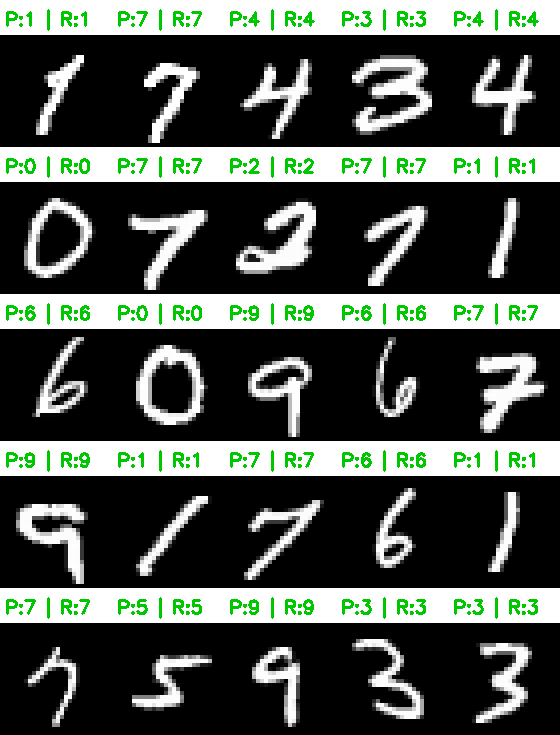

# Vision Transformer (ViT) Híbrido en CUDA

Un proyecto académico de alto rendimiento que implementa un **Vision Transformer Híbrido** desde cero en **C++ puro y CUDA**. El modelo está diseñado para clasificar los dígitos de la base de datos MNIST sin depender de ningún framework de Deep Learning (como PyTorch o TensorFlow), gestionando los kernels de GPU, la memoria VRAM y el algoritmo de Backpropagation de forma manual y altamente paralela.

---

## Arquitectura del Modelo

El modelo combina la capacidad de extracción de características locales de las Redes Convolucionales (CNN) con el entendimiento global y secuencial de los Transformers.

1. **CNN Front-End**: Extrae características espaciales de la imagen original. Pasa la imagen 28x28 por una capa convolucional, activación ReLU y Max Pooling.
2. **Patch Embedding**: La imagen transformada es recortada en parches (patches) planos, los cuales se linealizan y se mezclan con su "Positional Encoding" para que el Transformer sepa el orden original.
3. **Transformer Encoder Blocks**: Varios bloques apilados (cada uno con atención paralela `Multi-Head Attention` y una red `MLP` con activación `GELU`) enriquecen la información de cada parche al interactuar entre sí. Se usa `LayerNorm` intensivamente para mantener la estabilidad del gradiente.
4. **Classification Head (Token CLS)**: De toda la secuencia resultante, se extrae únicamente el primer vector (token `[CLS]`) que agrupa el conocimiento de toda la imagen, y se pasa por una capa densa que reduce las dimensiones a las 10 categorías finales mediante la función Softmax.

---

## Organización del Código y Archivos

El repositorio está fuertemente estructurado para maximizar el uso de VRAM de forma eficiente, dividiéndose en `include/` (cabeceras `.cuh`) y `src/` (implementaciones `.cu`).

* **Estructuras de Memoria Base**:
  * `Matrix.cu` / `Tensor3D.cu`: Gestionan las ubicaciones de memoria contigua dentro de la VRAM. Permiten hacer copias rápidas `toHost` (a CPU) y `fromHost` (a GPU).
* **Módulo Convolucional**:
  * `ConvolutionalLayer.cu`: Lanza hilos de CUDA para procesar píxeles a través de kernels de imagen de forma simultánea.
  * `PoolingLayer.cu` / `ActivationLayer.cu`: Reduce la dimensionalidad utilizando submuestreo espacial (MaxPooling).
  * `PatchEmbedding.cu`: Envuelve la CNN, recorta en parches y aplica el embedding.
* **Módulo Transformer**:
  * `MultiHeadAttention.cu`: Aplica Scaled Dot-Product Attention partiendo los cálculos en múltiples "cabezas" matemáticas que se ejecutan en paralelo en los *Streaming Multiprocessors* de NVIDIA.
  * `MultiLayerPerceptron.cu` / `TransformerEncoder.cu`: Crea el bloque residual con activación GELU nativa.
  * `LayerNorm.cu`: Normaliza las medias y varianzas utilizando reducciones por bloques en CUDA.
* **Orquestación**:
  * `VisionTransformer.cu`: La clase maestra. Conecta las piezas en la fase `forward` y traza todo el cálculo de gradientes a la inversa durante la fase `backward`. También implementa el descenso de gradiente (Actualización de Pesos).
  * `DataLoader.cu`: Procesa los archivos `.csv` en tiempo real y asigna los datos en memoria.
  * `main.cu`: Ciclo principal del programa, define arquitecturas, entrena por épocas y exporta resultados mediante OpenCV.

---

## Requisitos y Compilación

### Dependencias
* **NVIDIA CUDA Toolkit**: Versión 11 o superior.
* **Compilador C++**: Compatible con C++17.
* **OpenCV 4**: Para la renderización de la cuadrícula gráfica de predicciones (enlazado mediante `pkg-config`).

### Ejecución
El proyecto está optimizado para compilar rápidamente usando `make`. Por defecto está configurado para tarjetas Ada Lovelace (ej. RTX 4050 con `-arch=sm_89`), pero puede ajustarse en el `Makefile` si tienes otra tarjeta.

```bash
# Limpiar binarios antiguos (opcional)
make clean

# Compilar y ejecutar inmediatamente el entrenamiento
make run
```
Tras el entrenamiento masivo de 5 épocas sobre los datos particionados (Train, Val, Test), el sistema automáticamente generará y guardará el archivo visual **`resultados_prediccion.png`** en la carpeta principal.



---

## El Equipo (Autores y Contribuciones)

Este proyecto fue posible gracias al esfuerzo colectivo del equipo dividiendo el pipeline en 4 módulos integrados milimétricamente en C++:

* **Josue Samuel Philco Puma** *(El Integrador)*
  * Orquestación de la clase maestra `VisionTransformer`, desarrollo de la función de pérdida matemática multiclase (Cross-Entropy).
  * Arquitectura del ciclo de entrenamiento (`train`, `accuracy`, `predict`).
  * `DataLoader` y particionamiento del 70/15/15 del dataset masivo de 70,000 archivos, diseño del Makefile final y generación visual utilizando OpenCV nativo.

* **Johan Fabricio Lizarve Mamani** *(Feature Extractor)*
  * Desarrollo desde cero de la Red Neuronal Convolucional paralela (`ConvolutionalLayer`, `PoolingLayer`, `ActivationLayer`).
  * Lógica del recorte y la estructuración de la imagen en secuencias (`PatchEmbedding`) junto con su *Positional Encoding*.

* **Marko Julio Sumire Ramos** *(Atención Matemática y Memoria)*
  * Construcción de los cimientos en la VRAM de NVIDIA (`Matrix`, `Tensor3D`).
  * Implementación de los kernels de multiplicación de matrices complejas y el módulo core del modelo: El paralelismo atencional de `MultiHeadAttention` y *Scaled Dot-Product Attention*.

* **Erik Manuel Ramos Quispe** *(Encoder Block & Normalización)*
  * Ensamblaje del bloque secuencial `TransformerEncoderBlock` y el flujo de los tensores.
  * Desarrollo del `MultiLayerPerceptron`, cálculo masivo de medias y varianzas en `LayerNorm` y programación de las derivadas complejas de la función de activación `GELU`.
